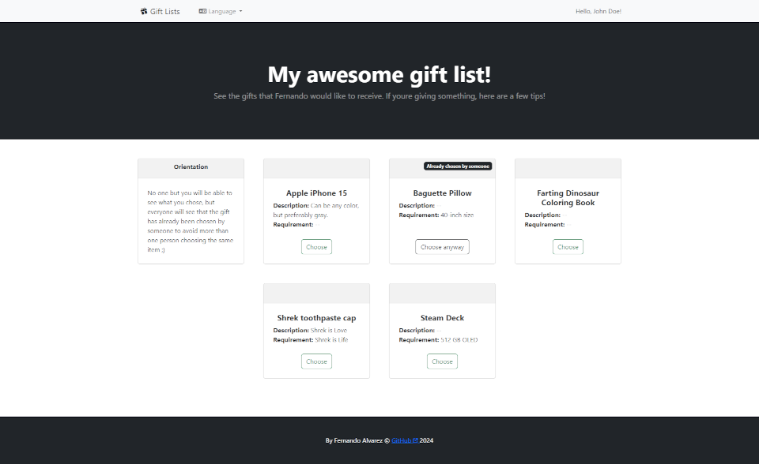

# Gift List application
Simple Kotlin + Spring web application to create and share gift lists.

You can deploy this application and use it to create and share gift lists for, for example, wedding, birthday, or anything you would like/need.

## Preview
#### Gift list management

#### Guest view

### Mobile preview


## What it uses
- [Kotlin](https://kotlinlang.org) 1.9 and Java 17 language.
- [Spring Boot](https://spring.io/projects/spring-boot) 3.2 web framework.
- [Thymeleaf](https://www.thymeleaf.org) template engine.
- [Postgres](https://www.postgresql.org) 12 database and [Flyway](https://flywaydb.org) migration.
- [Docker](https://www.docker.com) container.
  - [Dockerfile](./Dockerfile).
  - [docker-compose](./docker-compose.yml).

### Used assets
- Favicon: https://favicon.io/emoji-favicons/wrapped-gift/
- Admin theme: https://startbootstrap.com/theme/sb-admin-2
- Guest theme: https://startbootstrap.com/template/shop-homepage
- Country flags: https://github.com/lipis/flag-icons

## Features
- First access admin user creation.
- Basic gift list management.
  - Create and edit lists.
  - Add, edit and remove gifts.
  - Add, edit and remove guests.
    - Generate access link and/or QR code.
- Guests can see the gifts and choose what will give.
  - They can also see if the gift already was chosen by someone else to prevent two or more guests giving the same gift.
- Mobile responsive.

## What it lacks
- Payment system; its purpuse is only to share and manage gift lists with guests.
- Working internationalization.
  - It does have [English](./src/main/resources/messages_en.properties.bak) and [Portuguese](./src/main/resources/messages.properties) `message.properties` files, but it doesn't work inside a Docker container yet for some misterious reason. At the time being, the default language is Portuguese and the English one is disabled.
- Image upload.
- User creation. You can only create it in the first access or manually insert in the database.

## How to run
### Locally
1. Clone this repository.
2. Import this project on your [Kotlin capable IDE](https://kotlinlang.org/docs/kotlin-ide.html), like [IntelliJ](https://www.jetbrains.com/idea/).
3. Run the [dockerized Postgres](docker-compose.yml) database (or you can use your own Postgres instance).
   - The database will be set up automatically by Flyway.
   - Connection details in [application.properties](./src/main/resources/application.properties).
4. Run [GiftlistApplication.kt](./src/main/kotlin/alvarez/fernando/giftlist/GiftlistApplication.kt).
5. Access the web application exposed at http://localhost:8080 with your browser.

### Via Docker
1. Clone this repository.
2. Build the [Dockerfile](./Dockerfile) and run the Docker image with its dependency using one of the methods:
    - [Makefile](./Makefile):
       ```shell
       $ make
       ```
    - [Docker compose](./docker-compose.yml):
       ```shell
       $ docker-compose up --build giftlist
       ```
3. Access the web application exposed at http://localhost:8080 with your browser.

## How to use
1. The first time you access the application it will ask you the first user details. This user will be used to log in.
2. Create a gift list.
3. Add some gifts to it.
4. Also add some guests to it.
5. Copy the access link of one of your guests and share it with them. Each guest must access with its own access link, as it is attached to it.
6. As the guests access you gift list and choose the gifts, you will see what gifts were choosen by someone (but not by whom). They will also see that the gift already was chosen by someone else, to prevent two or more guests giving the same gift.
